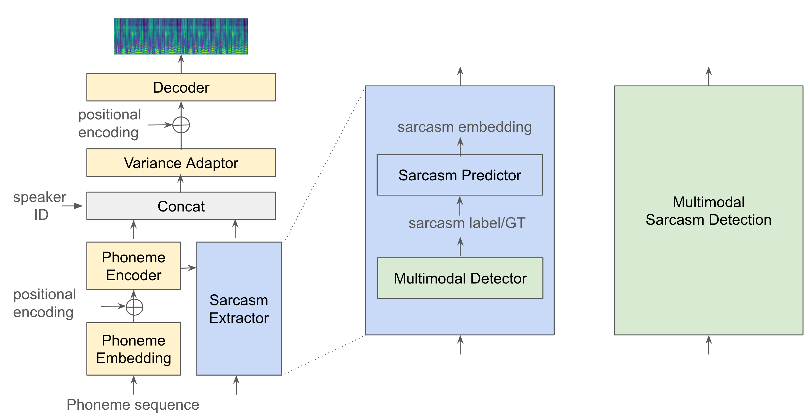

## Experiment results for sarcastic TTS

## An overview of sarcastic speech synthesis

### Update by Feb 23
- Denoised effect
    - [voicefixer](https://github.com/haoheliu/voicefixer)
    - [Davinci Resolve](https://www.blackmagicdesign.com/products/davinciresolve/whatsnew)
    - Adobe
- Fine-tuned FastSpeech 2 on MUStARD(MUStARD++)
    - w/o denoise
    - w/ voicefixer
    - w/ Davinci Resolve
    - w/ Adobe
- Pre-trained FS2 on Friends
    - w/o denoise
    - w/ voicefixer

## Part 1. Denoised effect
#### Original Samples

test on HTML
<audio controls>
    <source src="audio/1_60.wav" type="audio/wav" />
</audio>
<audio controls>
    <source src="audio/1_70.wav" type="audio/wav" />
</audio>
<audio controls>
    <source src="audio/1_70.wav" type="audio/wav" />
</audio>

<table>
  <tr>
    <th>音频名称</th>
    <th>播放器</th>
  </tr>
  <tr>
    <td>音频1</td>
    <td>
      <audio controls>
        <source src="audio/1_60.wav" type="audio/wav">
      </audio>
    </td>
  </tr>
  <tr>
    <td>音频2</td>
    <td>
      <audio controls>
        <source src="audio/1_70.wav" type="audio/wav">
      </audio>
    </td>
  </tr>
  <!-- 可以继续添加更多的音频行 -->
</table>

test on MD

  <audio controls="controls">
    <source type="audio/wav" src="audio/1_60.wav"></source>
  </audio>
  <audio controls="controls">
    <source type="audio/wav" src="audio/1_70.wav"></source>
  </audio>
  <audio controls="controls">
    <source type="audio/wav" src="audio/1_105.wav"></source>
  </audio>
  <audio controls="controls">
    <source type="audio/wav" src="audio/1_175.wav"></source>
  </audio>
  <audio controls="controls">
    <source type="audio/wav" src="audio/2_627.wav"></source>
  </audio>
  <audio controls="controls">
    <source type="audio/wav" src="audio/2_626.wav"></source>
  </audio>
  <audio controls="controls">
    <source type="audio/wav" src="audio/2_623.wav"></source>
  </audio>

#### Denoise by voicefixer

  <audio controls="controls">
    <source type="audio/wav" src="audio/Feb-22/voicefixer_mode0/1_60.wav"></source>
  </audio>
  <audio controls="controls">
    <source type="audio/wav" src="audio/Feb-22/voicefixer_mode0/1_70.wav"></source>
  </audio>
  <audio controls="controls">
    <source type="audio/wav" src="audio/Feb-22/voicefixer_mode0/1_105.wav"></source>
  </audio>
  <audio controls="controls">
    <source type="audio/wav" src="audio/Feb-22/voicefixer_mode0/1_175.wav"></source>
  </audio>
  <audio controls="controls">
    <source type="audio/wav" src="audio/Feb-22/voicefixer_mode0/2_627.wav"></source>
  </audio>
  <audio controls="controls">
    <source type="audio/wav" src="audio/Feb-22/voicefixer_mode0/2_626.wav"></source>
  </audio>
  <audio controls="controls">
    <source type="audio/wav" src="audio/Feb-22/voicefixer_mode0/2_623.wav"></source>
  </audio>

#### Denoise by Davinci Resolve

  <audio controls="controls">
    <source type="audio/wav" src="audio/Feb-22/DavinciResolve/1_60.wav"></source>
  </audio>
  <audio controls="controls">
    <source type="audio/wav" src="audio/Feb-22/DavinciResolve/1_70.wav"></source>
  </audio>
  <audio controls="controls">
    <source type="audio/wav" src="audio/Feb-22/DavinciResolve/1_105.wav"></source>
  </audio>
  <audio controls="controls">
    <source type="audio/wav" src="audio/Feb-22/DavinciResolve/1_175.wav"></source>
  </audio>
  <audio controls="controls">
    <source type="audio/wav" src="audio/Feb-22/DavinciResolve/2_627.wav"></source>
  </audio>
  <audio controls="controls">
    <source type="audio/wav" src="audio/Feb-22/DavinciResolve/2_626.wav"></source>
  </audio>
  <audio controls="controls">
    <source type="audio/wav" src="audio/Feb-22/DavinciResolve/2_623.wav"></source>
  </audio>

#### Denoised by Adobe(from Xiyuan)

## Part 2. Fined-tuned FS2 on MUStARD

#### Finetuned FS2(MUStARD, w/o denoise)

  <audio controls="controls">
    <source type="audio/wav" src="audio/Feb-22/fs2_wo_denoising_mustard/1_60_2.wav"></source>
  </audio>
  <audio controls="controls">
    <source type="audio/wav" src="audio/Feb-22/fs2_wo_denoising_mustard/1_70_2.wav"></source>
  </audio>
  <audio controls="controls">
    <source type="audio/wav" src="audio/Feb-22/fs2_wo_denoising_mustard/1_105_2.wav"></source>
  </audio>
  <audio controls="controls">
    <source type="audio/wav" src="audio/Feb-22/fs2_wo_denoising_mustard/1_175_2.wav"></source>
  </audio>

#### Finetuned FS2(MUStARD, w voicefixer)

  <audio controls="controls">
    <source type="audio/wav" src="audio/Feb-22/fs2_w_mode0_mustard/1_60_2.wav"></source>
  </audio>
  <audio controls="controls">
    <source type="audio/wav" src="audio/Feb-22/fs2_w_mode0_mustard/1_70_2.wav"></source>
  </audio>
  <audio controls="controls">
    <source type="audio/wav" src="audio/Feb-22/fs2_w_mode0_mustard/1_105_2.wav"></source>
  </audio>
  <audio controls="controls">
    <source type="audio/wav" src="audio/Feb-22/fs2_w_mode0_mustard/1_175_2.wav"></source>
  </audio>

#### Finetuned F2(MUStARD, w DavinciResolve)

  <audio controls="controls">
    <source type="audio/wav" src="audio/Feb-22/fs2_w_davinci_mustard/1_60_2.wav"></source>
  </audio>
  <audio controls="controls">
    <source type="audio/wav" src="audio/Feb-22/fs2_w_davinci_mustard/1_70_2.wav"></source>
  </audio>
  <audio controls="controls">
    <source type="audio/wav" src="audio/Feb-22/fs2_w_davinci_mustard/1_105_2.wav"></source>
  </audio>
  <audio controls="controls">
    <source type="audio/wav" src="audio/Feb-22/fs2_w_davinci_mustard/1_175_2.wav"></source>
  </audio>

## Part 3. Friends without sarcasm labels

| Spkear   | Amount |
|----------|--------|
| Chandler | 2566   |
| Joey     | 3018   |
| Monica   | 2598   |
| Phoebe   | 2642   |
| Rachel   | 2870   |
| Ross     | 2917   |
| Total    | 16611  |

#### Pre-trained on Friends TV(w/o denoise)
On test set (from back-translated text)

  <audio controls="controls">
    <source type="audio/wav" src="audio/Feb-22/fs2_wo_denoising_friends/1_60_2.wav"></source>
  </audio>
  <audio controls="controls">
    <source type="audio/wav" src="audio/Feb-22/fs2_wo_denoising_friends/1_70_2.wav"></source>
  </audio>
  <audio controls="controls">
    <source type="audio/wav" src="audio/Feb-22/fs2_wo_denoising_friends/1_105_2.wav"></source>
  </audio>
  <audio controls="controls">
    <source type="audio/wav" src="audio/Feb-22/fs2_wo_denoising_friends/1_175_2.wav"></source>
  </audio>

On validation set(512)

  <audio controls="controls">
    <source type="audio/wav" src="audio/Feb-22/fs2_wo_denoising_friends/dia0_utt4.wav"></source>
  </audio>
  <audio controls="controls">
    <source type="audio/wav" src="audio/Feb-22/fs2_wo_denoising_friends/dia1_utt0.wav"></source>
  </audio>
  <audio controls="controls">
    <source type="audio/wav" src="audio/Feb-22/fs2_wo_denoising_friends/dia1_utt2.wav"></source>
  </audio>
  <audio controls="controls">
    <source type="audio/wav" src="audio/Feb-22/fs2_wo_denoising_friends/dia4_utt3.wav"></source>
  </audio>

#### Pre-trained on Friends TV(denoised by voicerfixer)
On test set (from back-translated text, spk: Chandler)

  <audio controls="controls">
    <source type="audio/wav" src="audio/Feb-22/fs2_w_mode0_friends/1_60_2.wav"></source>
  </audio>
  <audio controls="controls">
    <source type="audio/wav" src="audio/Feb-22/fs2_w_mode0_friends/1_70_2.wav"></source>
  </audio>
  <audio controls="controls">
    <source type="audio/wav" src="audio/Feb-22/fs2_w_mode0_friends/1_105_2.wav"></source>
  </audio>
  <audio controls="controls">
    <source type="audio/wav" src="audio/Feb-22/fs2_w_mode0_friends/1_175_2.wav"></source>
  </audio>

On test set (from back-translated text, spk: Rachel)

  <audio controls="controls">
    <source type="audio/wav" src="audio/Feb-22/fs2_w_mode0_friends/1_60_2_rachel.wav"></source>
  </audio>
  <audio controls="controls">
    <source type="audio/wav" src="audio/Feb-22/fs2_w_mode0_friends/1_70_2_rachel.wav"></source>
  </audio>
  <audio controls="controls">
    <source type="audio/wav" src="audio/Feb-22/fs2_w_mode0_friends/1_105_2_rachel.wav"></source>
  </audio>
  <audio controls="controls">
    <source type="audio/wav" src="audio/Feb-22/fs2_w_mode0_friends/1_175_2_rachel.wav"></source>
  </audio>

On validation set(512)

  <audio controls="controls">
    <source type="audio/wav" src="audio/Feb-22/fs2_w_mode0_friends/dia0_utt4.wav"></source>
  </audio>
  <audio controls="controls">
    <source type="audio/wav" src="audio/Feb-22/fs2_w_mode0_friends/dia1_utt0.wav"></source>
  </audio>
  <audio controls="controls">
    <source type="audio/wav" src="audio/Feb-22/fs2_w_mode0_friends/dia1_utt2.wav"></source>
  </audio>
  <audio controls="controls">
    <source type="audio/wav" src="audio/Feb-22/fs2_w_mode0_friends/dia4_utt3.wav"></source>
  </audio>

#### Pre-trained on Friends TV(denoised by Davinci Resolve)

## Friends with sarcasm labels(to be continue...)

---
